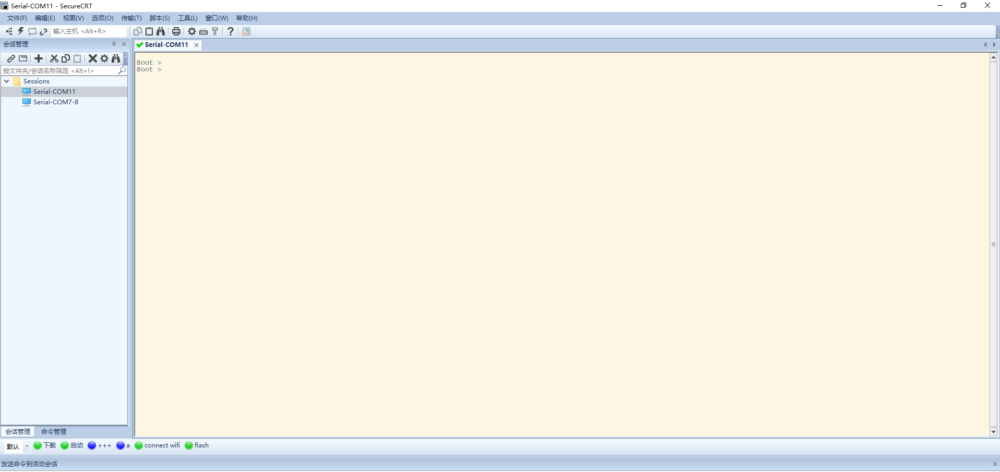
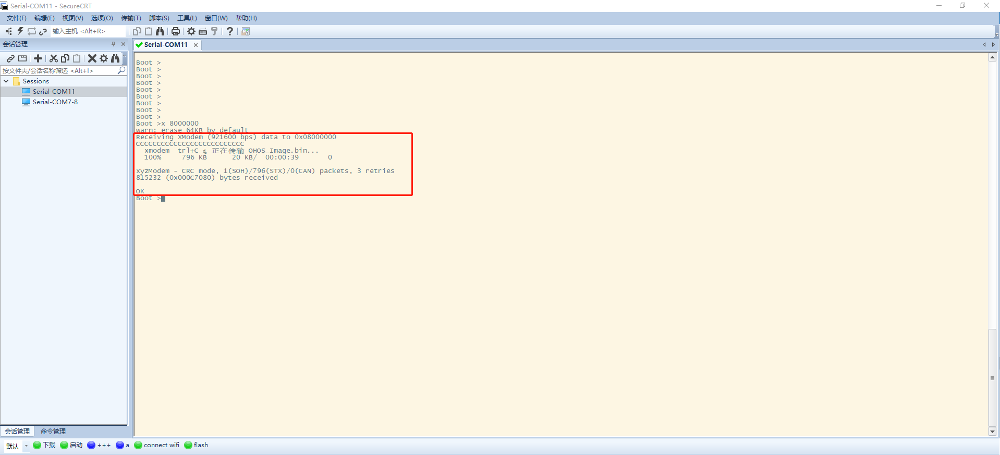

# device_chipsea

#### 介绍

##### 目录

```
device/soc/chipsea
├── cst85                                 # 芯片SOC名称
├── hals                                  # hals适配目录
│   └── communication                     # 连接类接口适配目录
│       └── wifi_lite                     # 轻量级wifi适配目录
├── Kconfig.liteos_m.defconfig            # kconfig 默认宏配置
├── Kconfig.liteos_m.series               # cst系列soc配置宏
└── Kconfig.liteos_m.soc                  # soc kconfig配置宏
```

整个编译框架如下：

```
├── cst85
│   └── liteos_m
│       └── sdk
│       └── sdk/bsp/*
│       └── sdk/bsp/driver/*
│       └── sdk/modules/*
├── hals
│   └── communication
│       └── wifi_lite
│           └── wifiservice
```

以下内容步骤参考[quickstart-lite-env-setup-linux](https://gitee.com/openharmony/docs/blob/master/zh-cn/device-dev/quick-start/quickstart-lite-env-setup-linux.md)。

仓库包含编译构建脚本和打包镜像工具。

系统要求： Ubuntu18.04 64位系统版本。

编译环境搭建包含如下几步：

1. 获取源码
2. 安装的库和工具
3. 安装python3
4. 安装hb
5. 安装arm-none-eabi-gcc
6. 编译流程
7. 烧录打印

## 获取源码

```shell
mkdir openharmony_chipsea

cd openharmony_chipsea

repo init -u ssh://git@gitee.com/openharmony-sig/manifest.git -b master --no-repo-verify -m devboard_cst85f01.xml

repo sync -c

repo forall -c 'git lfs pull'
```

## 安装的库和工具

> - 通常系统默认安装samba、vim等常用软件。

> - 使用如下apt-get命令安装下面的库和工具：

```
sudo apt-get install build-essential gcc g++ make zlib* libffi-dev e2fsprogs pkg-config flex bison perl bc openssl libssl-dev libelf-dev libc6-dev-amd64 binutils binutils-dev libdwarf-dev u-boot-tools mtd-utils gcc-arm-linux-gnueabi
```

## 安装Python3

1. 打开Linux编译服务器终端。
2. 输入如下命令，查看python版本号：

   ```
   python3 --version
   ```
   1. 运行如下命令，查看Ubuntu版本：

   ```
   cat /etc/issue
   ```

   2. ubuntu 18安装python。
   ```
   sudo apt-get install python3.8
   ```

3. 设置python和python3软链接为python3.8。

   ```
   sudo update-alternatives --install /usr/bin/python python /usr/bin/python3.8 1
   sudo update-alternatives --install /usr/bin/python3 python3 /usr/bin/python3.8 1
   ```
4. 安装并升级Python包管理工具（pip3），任选如下一种方式。

   - **命令行方式：**

     ```
     sudo apt-get install python3-setuptools python3-pip -y
     sudo pip3 install --upgrade pip
     ```
   - **安装包方式：**

     ```
     curl https://bootstrap.pypa.io/get-pip.py -o get-pip.py
     python get-pip.py
     ```

## 安装hb
### 安装方法

1. 运行如下命令安装hb

   ```
   pip3 uninstall ohos-build # 如果安装了hb,先卸载
   pip3 install build/lite
   ```
2. 设置环境变量

   ```
   vim ~/.bashrc
   ```

   将以下命令拷贝到.bashrc文件的最后一行，保存并退出。

   ```
   export PATH=~/.local/bin:$PATH
   ```

   执行如下命令更新环境变量。

   ```
   source ~/.bashrc
   ```
3. 执行"hb -h"，有打印以下信息即表示安装成功：

   ```
   usage: hb

   OHOS build system

   positional arguments:
     {build,set,env,clean}
       build               Build source code
       set                 OHOS build settings
       env                 Show OHOS build env
       clean               Clean output

   optional arguments:
     -h, --help            show this help message and exit
   ```

## 安装arm-none-eabi-gcc

1. 打开Linux编译服务器终端。
2. 下载[arm-none-eabi-gcc 编译工具下载](https://developer.arm.com/-/media/Files/downloads/gnu-rm/10.3-2021.10/gcc-arm-none-eabi-10.3-2021.10-x86_64-linux.tar.bz2)
3. 解压 [gcc-arm-none-eabi-10.3-2021.10-x86_64-linux.tar.bz2](https://developer.arm.com/-/media/Files/downloads/gnu-rm/10.3-2021.10/gcc-arm-none-eabi-10.3-2021.10-x86_64-linux.tar.bz2) 安装包至\~/toolchain/路径下。

   ```shell
   mkdir -p ~/toolchain/
   tar -jxvf gcc-arm-none-eabi-10.3-2021.10-x86_64-linux.tar.bz2 -C ~/toolchain/
   ```
4. 设置环境变量。

   ```
   vim ~/.bashrc
   ```

   将以下命令拷贝到.bashrc文件的最后一行，保存并退出。

   ```
   export PATH=~/toolchain/gcc-arm-none-eabi-10.3-2021.10/bin:$PATH
   ```
5. 生效环境变量。

   ```
   source ~/.bashrc
   ```

## 编译流程

[编译构建使用指](https://gitee.com/openharmony/docs/blob/master/zh-cn/device-dev/subsystems/subsys-build-mini-lite.md)

```shell
hb set

chipsea
  xts_demo
  wblink_demo

其中
"xts_demo"为兼容性测试的编译目标。
"wblink_demo"为正常连接模组的编译目标。

选择wblink_demo

hb build -f
```

## 烧录打印

1. 安装 FT2232H USB 转串口驱动程序 [FT2232H VCP 驱动](http://www.ftdichip.cn/Drivers/VCP.htm)。安装完成以后会有两个虚拟的串口端口出来。
2. 串口的配置（推荐使用SecureCRT串口工具）：波特率=921600， 数据位=8， 停止位=1， 奇偶校验=N，Flow control都不勾选。
3. 把 out/cst85_wblink/`<product name>`/OHOS_Image.bin 拷贝到windows。
4. 把核心板的升级模式跳线短路，重新给开发板cst85_wblink上电，按下核心板的开机按键，此时串口终端显示进入到烧录模式。
**图 1**  cst85_wblink进入烧录模式 <a name=""></a>

5. 在 SecureCRT 串口输入回车，进入 BOOT 命令状态，输入 x 8000000 命令，进入烧录等待状态，然后选择 SecureCRT 的 Transfer 菜单下的 Send Xmodem 命令，
**图 2**  Xmodem方式烧录程序 <a name=""></a>


选择上面编译出来的OHOS_Image.bin 文件，然后进行程序的烧录，等烧录结束后的打印信息如下所示。
**图 2**  烧录完成 <a name=""></a>


# 相关仓

* [device/soc/chipsea](https://gitee.com/openharmony/device_soc_chipsea)
